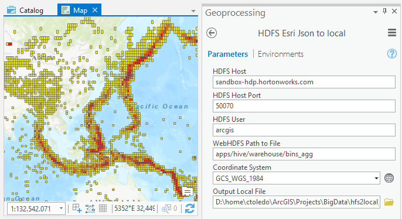

# HDFS Toolbox

## Tools

### HDFS to local - Esri JSON

This tool gets files from a Hadoop WebHDFS REST API path and concatenetes the mapreduced part-* files into one output local file. This tools assumes that the files are text files containing Esri JSON formated feature lines.

## Dependencies
The Python [pywebhdfs](https://pypi.python.org/pypi/pywebhdfs) library is required for WebHDFS support.

### Installing pywebhdfs:
1. Start the ArcGIS Pro Python 3 conda environment: "%PROGRAMFILES%\ArcGIS\Pro\bin\Python\Scripts\proenv"
1. pip install pywebhdfs

## Contributing
Contributors are welcomes!

## Licensing

Licensed under the Apache License, Version 2.0 (the "License"); you may not use this file except in compliance with the License. You may obtain a copy of the License at:

http://www.apache.org/licenses/LICENSE-2.0

Unless required by applicable law or agreed to in writing, software distributed under the License is distributed on an "AS IS" BASIS, WITHOUT WARRANTIES OR CONDITIONS OF ANY KIND, either express or implied. See the License for the specific language governing permissions and limitations under the License.

A copy of the license is available in the repository's license.txt file.
